# AZ-700 Lab: Routing in Azure WAN

Azure Virtual WAN provides a centralized hub architecture for securely connecting on-premises resources with Azure networks and services.

## <u> Our Architecture for the lab</u>

 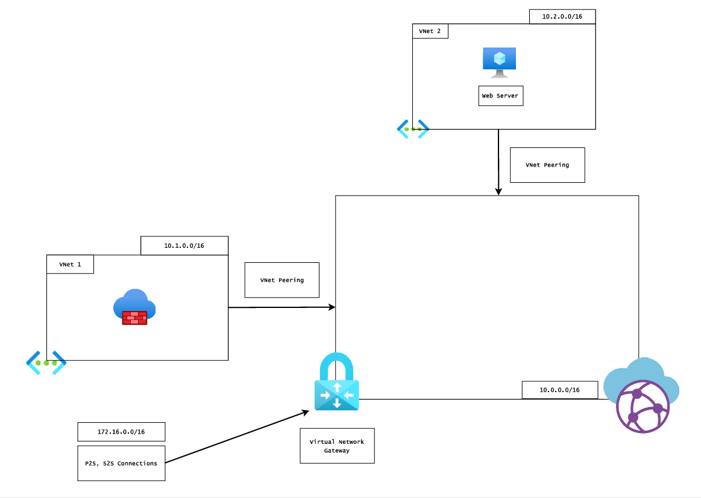 

Components in our architecture are as follows:

1. Azure Virtual WAN resource
2. Virtual WAN Hub
3. VPN Gateway (P2S + S2S)
4. Two VNets:
   - VNet1 — contains Azure Firewall (Basic is enough)
   - VNet2 — contains a Web Server

**Important** : `Follow the address spaces shown in the diagram to avoid overlaps.`

---

## <u> Routing Scenario </u>

- VNet ↔ VNet traffic should flow directly
- VPN client / branch traffic should flow:

  `VPN Gateway → Firewall → Destination VNet`

  Return path must also go through the firewall to maintain symmetric routing

This requires custom hub route tables and controlled propagation.

## <u> Some basic terminologies in Azure WAN routing </u>

_**Association**_ : Association links a connection to a specific hub route table.

- A connection can have only one association
- Determines where traffic is forwarded

_**Propagation**_ : Propagation allows prefixes from a connection to be advertised into route tables.

- A connection can propagate to multiple route tables
- Controls route visibility

`Without propagation, prefixes are not automatically learned.`

_Note : Propagation helps in discovery of a connected address space. If a connection is not propagated to a route table, the prefixes from that connection will not be included in the route table and hence the traffic will not flow to that connection directly. Though we can add a static route to the route table to make the traffic flow via that connection, but that is not a recommended approach._

_**Branches**_ : Branches include:

- Site-to-Site VPN
- Point-to-Site VPN
- ExpressRoute

`Branch connections are associated with the Default route table by design, but their propagation behavior can be controlled. We cannot associate a custom route table to our branches.`

_**labels**_ : A logical grouping of connections. Rather than adding individual connections for propagation we can add a label to the connections and then allow that label to propagate to the route table. This way, we can manage the routing in a large scale deployment with multiple connections.

This way, we are effectively allowing all the peering to advertise their prefix and next hop to the default hub route table. This is a good way to manage the routing in a large scale deployment with multiple connections. _**Though this needs to be done carefully since it might lead to unexpected routing behavior by introducing unwanted routes**_

## Routing Rules to Remember

- Most specific prefix match wins
- Association controls forwarding
- Propagation controls route learning
- Branch connections always associate with Default route table
- Always verify using Effective Routes

---

## <u> Adding the Peering Connections </u>

 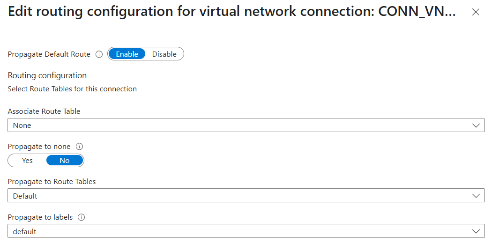 

While adding a peering to the Hub, we can choose the route tables where we want to advertise the prefixes coming from the connection. The process is simplified via a label. We might want to propagate to multiple tables but which can become complex is large enterprises so we just mention the label where we want to propagate.

  

See even though I didn't allow the connection to propagate to the default hub route table or a label, Azure has automatically set it to the _**default route table**_ by default. Actually, this need to be taken care of if we intend to have custom routing for our Vnets. Because if you think deeply, traffic from our P2S vpn will enter the hub and consult the default hub route table for routing decision. If it sees a target prefix with a next hop matching our destination then the traffic will be forwarded to the next hop (here, it is the vnet peering connection). Our custom routing will fail here. To verify routing behavior, we can use the Effective Routes view. It will show the full list of learned prefixes in a route table along with their next hop.

 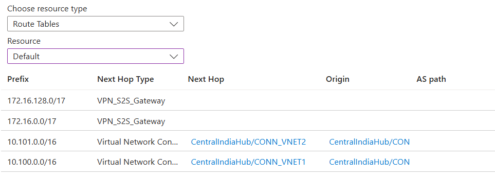 

This is the default route table. Since, you remember that the peering connection is propagating to the default hub route table, we can see the prefix of the vnet being advertised in the default hub route table with the next hop as the peering connection. But the caveat is that since the peering is not associated with any route table. The traffic will eventually drop in the return path from the vnets to the vpn gateway.

Note : I by mistake propagated a route to the default hub route table which was collecting the traffic from the vpn gateway and sending it to a peering connection to vnet1. But azure has automatically updated the route table to include a more specific route (172.16.0.0/17 and 172.16.128.0/17) for the vpn gateway connection. Remember, in a route table, the most specific route is always preferred. So any traffic for the destination prefix 172.16.0.0/16 will follow the one advertised by the gateway and the custom route will be ignored. Though this is not the case always and might lead to routing loops in some cases.

 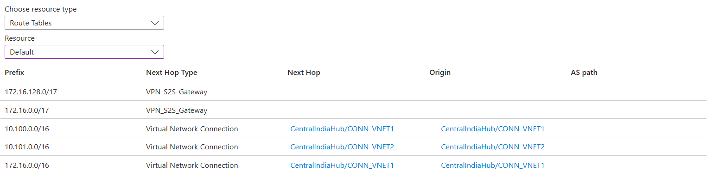 

---

## <u> Adding a Custom Route to the Default Hub Route Table </u>

 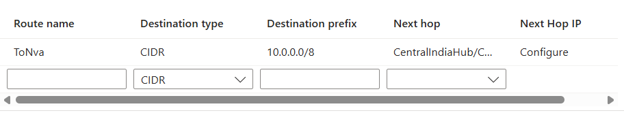 

We need a custom route to forward the traffic from the vpn gateway to the firewall. This is because the hub route table (default) does not know about the peered address spaces since we have not allowed the peering connection to propagate to the default hub route table.

---

## <u> Setting up the Custom Route Table </u>

Add a new route table that we will associate to the peered vnets. Any traffic leaving the Vnets must consult this route table for routing decision. To auto learn the prefixes we will also propagate to the same table.

 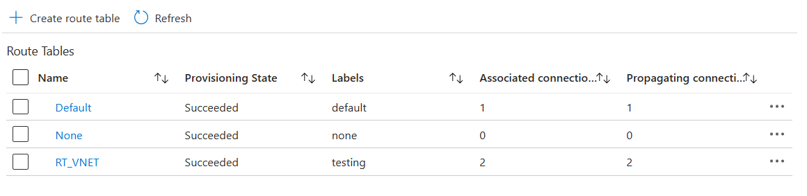 

### Associations

The branch connection are _**greyed out**_. Branch connections appear greyed out because they cannot be associated with custom route tables. This is by design.

 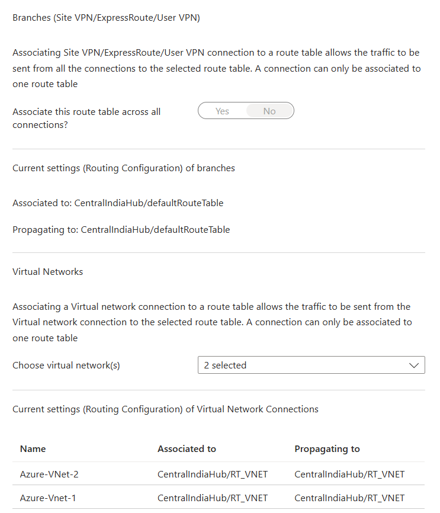 

### Propagations

Make sure we are not propagating from the branch connections to this table.

 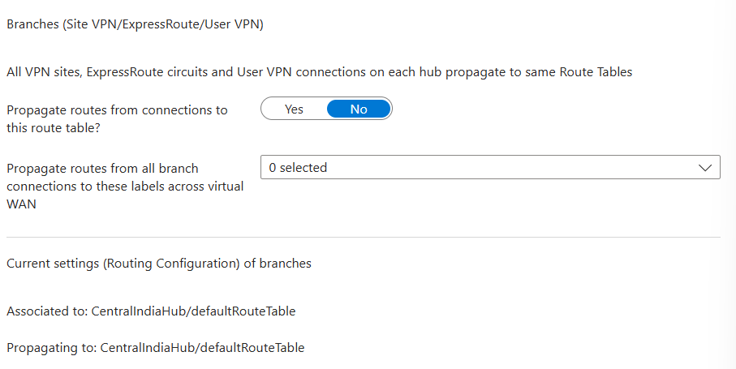 
 
 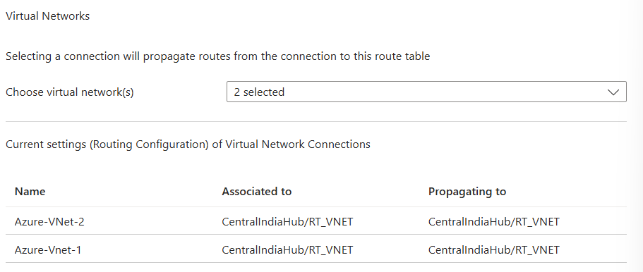 

Now edit the final peering connection for both peering in the following manner. Both should associate and propagate to the same table. Propagation because we want the prefixes to be advertised in the route table and association because we want the traffic to be forwarded to the peering connection when the destination prefix is matched. We don't want to propagate to any other table because that might lead to unexpected routing behaviour (not even default labelled) because it might lead to routing loops.

 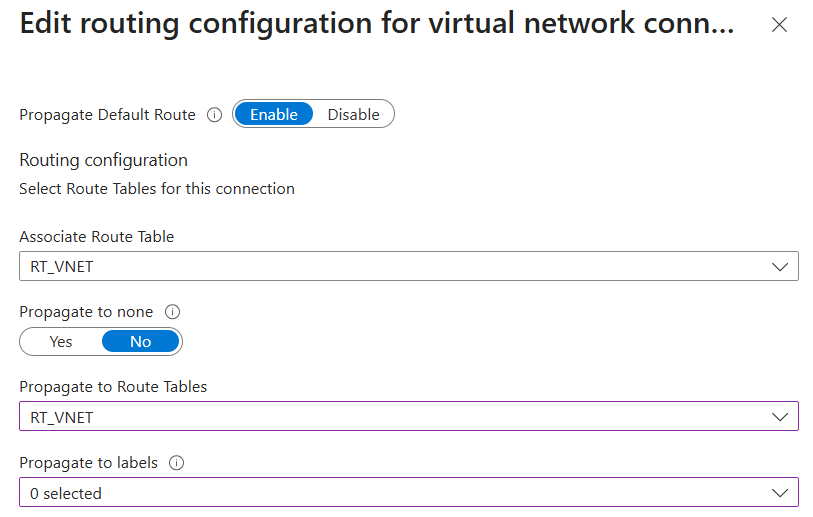 

Since the branch connections are not propagating to this route table, we need to add a return path explicitly and also to maintain symmetry of the traffic coming from the vpn gateway.

 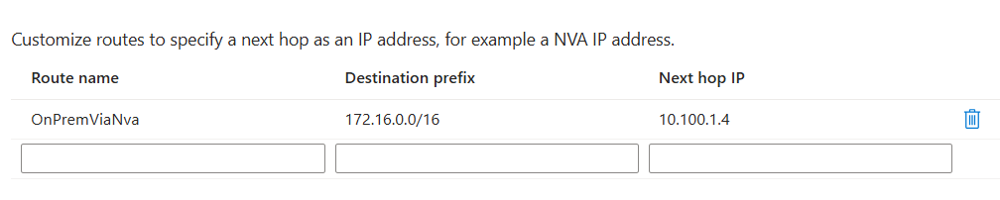 

`With this configuration, traffic from the VPN gateway enters the hub and is evaluated against the Default route table. The default route sends it to the firewall. The firewall then forwards the traffic to the destination VNet via the peering connection using the custom route table. Return traffic follows the same path in reverse, maintaining symmetric routing.`

---

## <u> Final Routing Status </u>

### Default Hub Route Table

 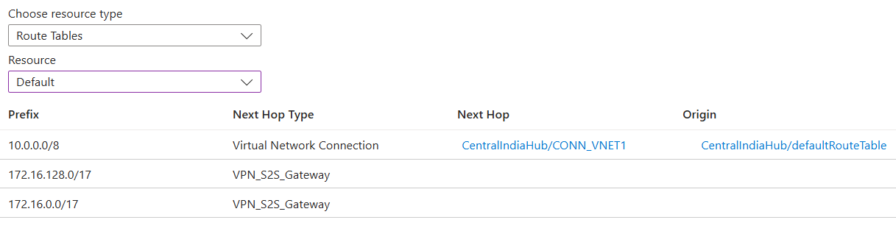 

### Custom Route Table

 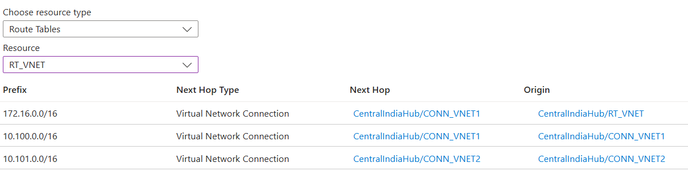 

Users trying to access the web server from the vpn client should be able to access it successfully. The traffic will flow from the vpn gateway to the firewall and then to the web server in the destination vnet. The return traffic will also follow the same path in reverse.

Request Flow (Web Server Traffic) :

`VPN Gateway → VNet1 → Firewall → VNet2 → Web Server`

Return Flow (Web Server Traffic) :

`Web Server → VNet2 → Firewall → VNet1 → VPN Gateway`
