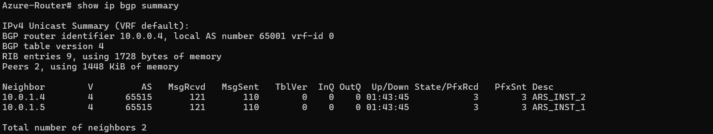
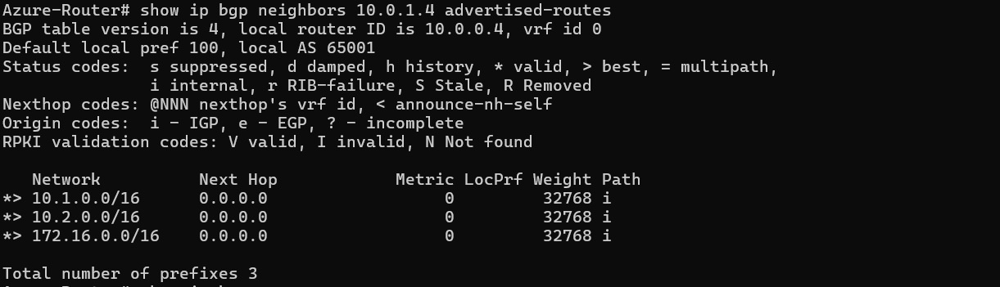
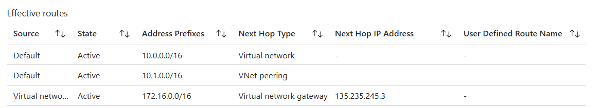
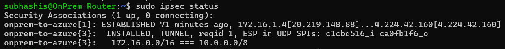
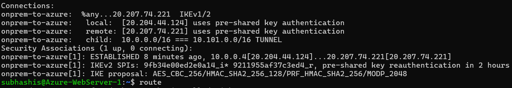
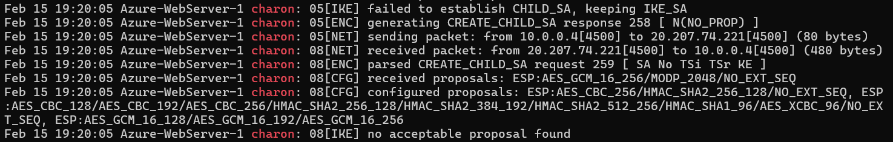
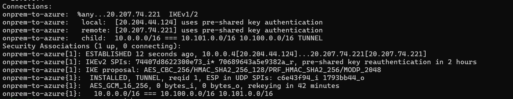

# AZ-700 Lab: Dynamic Hub-Spoke Routing with Azure Route Server and Linux NVA

The idea is to build a hub-and-spoke architecture where the hub VNet contains the NVA (Network Virtual Appliance) router, and the spoke VNets represent different departments (Sales and Marketing). The on-premises network will be simulated using a separate VNet.

- **Hub VNet**: `10.0.0.0/16` (contains the NVA)
- **Spoke VNets**:
  - `10.1.0.0/16` (Sales)
  - `10.2.0.0/16` (Marketing)
- **On-Prem VNet**: `172.16.0.0/16` (simulated using a separate VNet)
- **Routing**: eBGP via Azure Route Server (ARS) and FRRouting (FRR)
- **Tunneling**: Policy-based IPsec VPN using StrongSwan

---

## On the Azure Side

### Azure Hub

- Deploy an Azure Linux VM in the hub VNet to act as a router.
- Configure Azure Route Server (ARS) in the hub VNet to enable dynamic routing with the NVA.

**Note:** Enable **_Branch-to-Branch_** routing on the ARS.

**Note:** We will peer the NVA with ARS. ARS will then push routes directly to the spoke VNets, so every VM in the spoke VNets will receive a custom route requiring all the traffic to pass through the NVA. No UDRs are required in the spoke VNets. Since, ARS uses BGP so if the NVA goes down then the custom routes will be removed automatically.

---

### Azure Spokes

- Deploy Azure Linux VMs in each spoke VNet (Sales and Marketing) to represent departmental resources.
- Ensure the spoke VNets are peered with the hub VNet and that **allow remote vnets to use the ARS in the hub** is enabled so routing can be propagated to the spokes.

---

## Setting Up the Azure NVA Router

_IP forwarding must be enabled on the NVA VM NIC to allow it to route traffic between the spokes and the on-premises network._

- SSH into the NVA
- Enable IPv4 forwarding at the OS level:

```
# Enable forwarding for the current session
sudo sysctl -w net.ipv4.ip_forward=1

# Make it persistent across reboots
echo "net.ipv4.ip_forward=1" | sudo tee -a /etc/sysctl.conf
```

---

### Install FRRouting (FRR)

FRR is a modern routing suite for BGP on Linux.

```
sudo apt update
sudo apt install frr -y
```

---

### Configure BGP on the NVA to Peer with ARS

1. Enable the BGP daemon in FRR:
   `sudo nano /etc/frr/daemons`
2. Set `bgpd=yes`, save, and exit.
3. Restart FRR:
   `sudo systemctl restart frr`
4. Enter the FRR shell:
   `sudo vtysh`

```
conf t
router bgp 65001
    bgp router-id <VM-PRIVATE-IP>       # Use the NVA private IP as the router ID
    no bgp ebgp-requires-policy

    neighbor <ARS-PRIVATE-IP1> remote-as 65515
    neighbor <ARS-PRIVATE-IP2> remote-as 65515

    address-family ipv4 unicast
        neighbor <ARS-PRIVATE-IP1> next-hop-self
        neighbor <ARS-PRIVATE-IP2> next-hop-self

        network <CIDR_RANGE_1>
        network <CIDR_RANGE_2>
        network <CIDR_RANGE_3>

        no bgp network import-check
    exit-address-family
exit
write memory
```

---

### Verification

From the FRR shell (`vtysh`):

- **Check neighbor status**:  
  `show ip bgp summary`  
  The **State/PfxRcd** column should show a number (e.g., 5), not _Active_ or _Idle_.



- **Check advertised routes**:  
  `show ip bgp neighbors <ARS-PRIVATE-IP1> advertised-routes`  
  This confirms the NVA is advertising spoke routes to Azure.



These steps establish a BGP session between the NVA and Azure Route Server and enable dynamic route exchange. The NVA advertises the spoke and on-prem routes to ARS, which then propagates them across the Azure network.

_Any newly peered spoke VNet will automatically inherit advertised routes if allow gateway transit is enabled on the peering._

---

## Verify the propagation of routes to the spokes

On the spoke VMs, navigate to Networking > Effective Routes. You should see the routes from the Route Server (ARS) with the next hop as the NVA. This confirms that the spokes are receiving the routes advertised by the NVA via ARS.



---

## Enabling StrongSwan for IPsec VPN

Install StrongSwan on the NVA:

```
sudo apt-get update && sudo apt-get install -y strongswan
```

---

## On-Premises Simulation

### Setting Up the On-Prem Router

No complex router setup is required for the on-prem simulation. Deploy the on-prem environment using the ARM template script [here](./onPremHub.json)

_This deploys a simple Linux VM in a separate VNet. It is automatically configured with VPN and BGP components to peer with the Azure NVA router._

---

## Setting Up the IPsec VPN (Both Sides)

Set up a shared PSK for the VPN tunnel:

```
sudo bash -c 'cat <<EOF > /etc/ipsec.secrets
<NVA_Public_IP> <OnPrem_Public_IP> : PSK "AzureOnPremPass123"
EOF'
```

---

### StrongSwan Configuration

Run `sudo nano /etc/ipsec.conf`:

```
# left = local network
# right = remote network

# On-prem router
conn onprem-to-azure
    authby=secret
    left=%any
    leftid=<ONPREM_PUBLIC_IP>
    leftsubnet=<ONPREM_CIDR_RANGE_1>, <ONPREM_CIDR_RANGE_2>
    right=<AZURE_PUBLIC_IP>
    rightsubnet=<AZURE_CIDR_RANGE_1>, <AZURE_CIDR_RANGE_2>
    ike=aes256-sha256-modp2048
    esp=aes256-sha256
    auto=start

# Azure NVA router
conn azure-to-onprem
    authby=secret
    left=%any
    leftid=<AZURE_PUBLIC_IP>
    leftsubnet=<AZURE_CIDR_RANGE_1>, <AZURE_CIDR_RANGE_2>
    right=<ONPREM_PUBLIC_IP>
    rightsubnet=<ONPREM_CIDR_RANGE_1>, <ONPREM_CIDR_RANGE_2>
    ike=aes256-sha256-modp2048
    esp=aes256-sha256
    auto=start
```

**Note**: Policy-based VPNs are very picky regarding traffic selection. If the traffic does not match the specific CIDR ranges defined in the policy (Proxy IDs), it is dropped. When peering VNets in Azure, every Spoke address space must be explicitly included in the policy (separated by commas) so the gateway can negotiate the correct Security Association. Similarly, all on-prem address spaces must be listed. In contrast, for Route-based VPNs, both the source and destination selectors are typically set to 0.0.0.0/0, and the actual pathing is handled by the routing tables of the routers on both sides.

Restart StrongSwan:

```
sudo systemctl restart strongswan-starter
ipsec restart
```

Verify tunnel status:

```
sudo ipsec statusall
```

You should see the connection state as **ESTABLISHED** for both directions. Additionaly, if you access the nginx web server on the on-prem VM from the spoke VMs, it should work, confirming end-to-end connectivity through the NVA and the VPN tunnel.



**Note** : _In the world of Software Defined Networking(SDN), the concept of next hop is that if we can transmit the traffic to a specific destination to that point, it will automatically route it to the correct destination since it knows the desired destination._

## Troubleshooting

IPsec tunnels are established in 2 phases: Phase 1 (IKE SA) and Phase 2 (IPsec SA). In phase 1 the connection is established and in the second phase the data plane is established.

Sometimes, the IPsec tunnel may establish successfully, but traffic may not flow as expected. Here are some common troubleshooting steps:

1. **Check IPsec Status**: Use `sudo ipsec statusall` to check the status of the IPsec tunnels. Look for the keyword **INSTALLED** under each of the tunnel configurations. If absent, you might see something like this.



It means that the tunnel is established but the data plane is not up.

2. **Check Logs**: Type the command `sudo tail -f /var/log/syslog | grep charon` to view real-time logs from StrongSwan. Look for any error messages or warnings that could indicate issues with the tunnel establishment or traffic flow.



Here the issue was the mismatch in the entryption protocols between the on-prem and Azure sides. Both of them could not agree on a common protocol to encrypt the traffic, so the tunnel was established but the data plane was not up.

3. **Verify Configuration**: Double-check the IPsec configuration on both sides. Ensure that the PSK, encryption algorithms, and subnet definitions match exactly. Even a small typo can cause issues.

In my case, i had to check the protocols in azure vpn connection and make sure they match the ones defined in the StrongSwan configuration file. After this change, the tunnel was established successfully and the data plane was up, allowing traffic to flow between the on-premises network and the Azure spokes.



Finally, we can see the **INSTALLED** keyword in the IPsec status output, confirming that both the control plane and data plane of the VPN tunnel are up and running.
