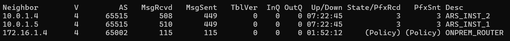

## Architecture overview

The idea is to have a hub-and-spoke architecture, where the hub VNet will contain the NVA (Network Virtual Appliance) firewall, and the spoke VNets will represent different departments (Sales and Marketing). The on-premises network will be simulated using a separate VNet.

- **Hub VNet**: `10.0.0.0/16` (Contains the NVA)

- **Spoke VNets**: `10.1.0.0/16` (Sales), `10.2.0.0/16` (Marketing)

- **On-Prem VNet**: `172.16.0.0/16` (Simulated via separate VNet)

- **Routing**: eBGP via Azure Route Server (ARS) and FRRouting (FRR).

- **Tunneling**: Policy-based IPsec VPN via StrongSwan.

## on the azure side

### For the Azure Hub

- Deploy an Azure Linux VM in the hub VNet to act as a router.
- Configure Azure Route Server (ARS) in the hub VNet to enable dynamic routing with the NVA.

note: we will peer our nva with the ARS, and the ARS will directly push the routes to the spoke VNets, so every vm in the spoke VNets will have a default route pointing to the NVA. No need for UDRs in the spoke VNets.

### For the Azure Spokes

- Deploy Azure Linux VMs in each spoke VNet (Sales and Marketing) to represent departmental resources.
- Ensure that the spoke VNets are peered with the hub VNet and allow Gateway Transit to enable routing through the NVA.

### setting up the azure nva router

_IP Forwarding must be enabled on the NVA VM's NIC to allow it to route traffic between the spokes and the on-premises network._

- ssh to the NVA
- Enable IPv4 Forwarding (OS level):

```
# Enable forwarding for the current session
sudo sysctl -w net.ipv4.ip_forward=1

# Make it permanent after a reboot
echo "net.ipv4.ip_forward=1" | sudo tee -a /etc/sysctl.conf
```

- Install FRRouting (FRR): FRR is the modern suite for BGP on Linux

```
sudo apt update
sudo apt install frr -y
```

- Configure BGP on the NVA to peer with Azure Route Server (ARS):

1. Enable BGP deaemon in FRR: `sudo nano /etc/frr/daemons`
2. Set `bgpd=yes` and save the file `ctrl+o`, `Enter`, then exit with `ctrl+x`.
3. Restart FRR: `sudo systemctl restart frr`
4. Enter the FRR shell: `sudo vtysh`

```
conf t
router bgp 65001
    bgp router-id <VM-PRIVATE-IP>       # Use the NVA's private IP as the router ID
        no bgp ebgp-requires-policy     # Allow BGP sessions without needing a policy

        neighbor <ARS-PRIVATE-IP1> remote-as 65515
        neighbor <ARS-PRIVATE-IP2> remote-as 65515

        # Force-enable the IPv4 channel for BGP sessions
        address-family ipv4 unicast

            # Ensures the NVA tells ARS to send traffic TO the NVA
            neighbor <ARS-PRIVATE-IP1> next-hop-self
            neighbor <ARS-PRIVATE-IP2> next-hop-self

            network 10.1.0.0/16   # Advertise the Sales Spoke
            network 10.2.0.0/16   # Advertise the Marketing Spoke
            network 172.16.0.0/16 # Advertise the On-Prem VNet

            # Tell BGP to ignore the local RIB check
            no bgp network import-check
        exit-address-family
    exit
exit
write memory
```

- Verification

From within the VM shell (vtysh):

Check Neighbor Status: Run `show ip bgp summary`. You want to see "State/PfxRcd" as a number (e.g., 5), not Active or Idle.

Check Advertised Routes: Run `show ip bgp neighbors <ARS-PRIVATE-IP1> advertised-routes`. This confirms the VM is telling Azure about the Spokes.



- These steps will establish a BGP session between the NVA and Azure Route Server, allowing dynamic route exchange. The NVA will advertise the spoke and on-prem routes to ARS, which will then propagate them to the rest of the Azure network.

_Any newly peered spoke VNet will automatically inherit the advertised routes if gateway transit is allowed on the peering._

#### Enabling StrongSwan for IPsec VPN

- Install StrongSwan on the NVA:

```
sudo apt-get update && sudo apt-get install -y strongswan
```

## For the On-Premises Simulation

### setting up the on-prem router

- we don't need any complicated router setup for the on-prem simulation. Deploy an on-prem environment using the script [here](./onPremHub.json)

_This will deploy a simple Linux VM in a separate VNet. It is automatically configured with vpn and BGP to peer with the NVA router in Azure._

## Setting up the IPsec VPN (on both sides)

- setup a secret PSK key for the vpn tunnel

```
sudo bash -c 'cat <<EOF > /etc/ipsec.secrets
<NVA_Public_IP> <OnPrem_Public_IP> : PSK "AzureOnPremPass123"
EOF'
```

- Configure StrongSwan on the NVA to establish an IPsec VPN tunnel with the on-premises router. Create a configuration file at `/etc/ipsec.conf` with the following content:

```
sudo nano /etc/ipsec.conf

# left - local
# right - remote

# use this for on-prem router
conn onprem-to-azure
    authby=secret
    left=%any
    leftid=<ONPREM_PUBLIC_IP>
    leftsubnet=<ONPREM_CIDR>
    right=<NVA_PUBLIC_IP>
    rightsubnet=<AZURE_HUB_CIDR>
    ike=aes256-sha256-modp2048
    esp=aes256-sha256
    auto=start

# use this for azure nva router
conn azure-to-onprem
    authby=secret
    left=%any
    leftid=<NVA_PUBLIC_IP>
    leftsubnet=<AZURE_HUB_CIDR>
    right=<ONPREM_PUBLIC_IP>
    rightsubnet=<ONPREM_CIDR>
    ike=aes256-sha256-modp2048
    esp=aes256-sha256
    auto=start

```

- Restart the StrongSwan service to apply the configuration:

```
sudo systemctl restart strongswan-starter
```

- Verify the VPN tunnel is established by checking the status:

```
sudo ipsec statusall
```

- You should see the connection status as "ESTABLISHED" for both directions (onprem-to-azure and azure-to-onprem).
